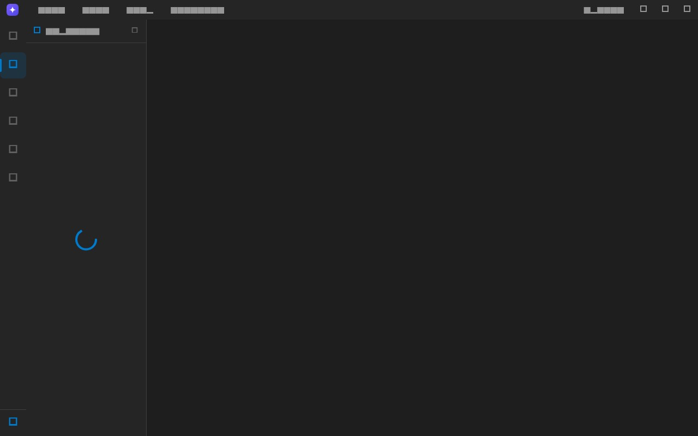
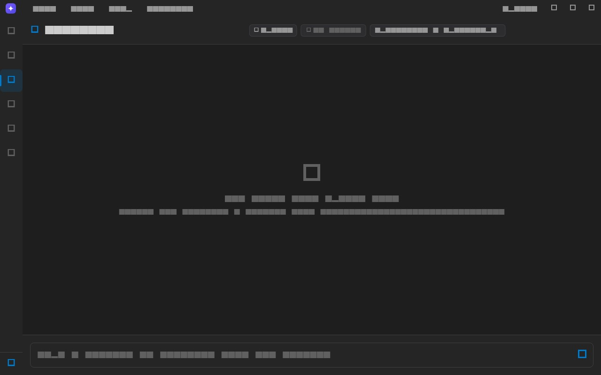
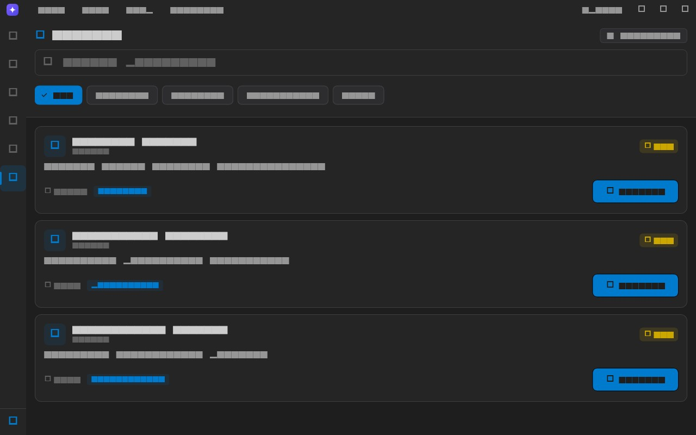
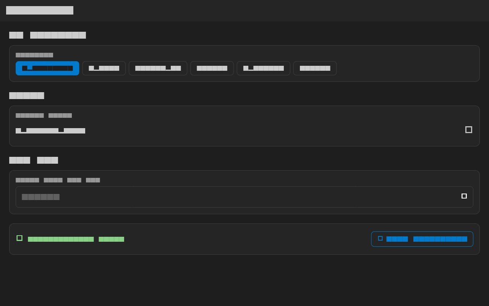

# Heides Lens


**The nervous system for your code, with eyes.**

Heides Lens is the visual companion to [HEIDES](https://github.com/AbduljabbarBXR/heides) — the deterministic code nervous system that maps every file, symbol, and call into a persistent graph, then guards every change against it. Lens is the UI: open a folder, see the mesh, query who-calls-what, review real findings, and plan against reality.

It is not another coding assistant. It is the brain your codebase never had — visualized, queryable, and standing guard.

> All screenshots are rendered from the real app UI (same theme, fonts, layouts)
> via golden tests in `mobile/test/screenshots/`. Regenerate with
> `flutter test test/screenshots --update-goldens`.

## Documentation

- [User Guide](docs/user-guide.md) — visual walkthrough of every app section
- [HEIDES](https://github.com/AbduljabbarBXR/heides) — the engine: Spine graph, Harmony guards, Grounding plans
- [Plugin API](docs/plugin-api.md) — manifest format, hooks, permissions
- [Hook Reference](docs/hook-reference.md) — every hook and its arguments
- [Security](docs/security.md) — threat model and hardening notes
- [Architecture](ARCHITECTURE.md) — full design document

The app ships with an in-app documentation viewer: **Help → Documentation**.

## Table of Contents

- [Features](#features)
- [Documentation](#documentation)
- [Architecture](#architecture)
- [Installation](#installation)
- [Quick Start](#quick-start)
- [Configuration](#configuration)
- [Plugin System](#plugin-system)
- [Development](#development)
- [Contributing](#contributing)
- [Roadmap](#roadmap)
- [Discussion](#discussion)
- [License](#license)

## Features

### First Launch


- Choose a logo for your Lens from five identity variants
- **HEIDES engine setup** — one click installs the engine locally (no account, no cloud)
- Interactive tour of the neural mesh, query, review, and guards

### Neural Mesh (Graph)


- Layered dependency layout (Sugiyama-style) with aligned columns
- **Orthogonal edges** that route around cards — dependency flow, back-edges/cycles, and vertical links are color-coded
- Filter by node type, search, grid view toggle
- Navigation: drag to pan, double-click / wheel / pinch to zoom, minimap, fit-to-view

### Explorer (File Tree)



- Language-aware file tree with colored icons
- Sidebar closed by default — toggle with the Explorer icon or `Ctrl+1`
- Click any file to open the viewer with breadcrumbs and line numbers (`Esc` to return)

### Query (Workflow Chat)



- Ask the nervous system about your code — grounded in the HEIDES graph, not guesses
- Automatic `spine.query` on symbols mentioned in your question
- Workspace manifest (symbols, entrypoints, hubs) injected into every request
- Providers: OpenRouter, OpenAI, Anthropic, Gemini, Ollama (optional)

### Review (Findings)


- Real HEIDES `harmony` findings: security taint, edge cases, dependency risk
- Sorted blocker → critical → warning → info with file:line evidence
- Click a finding to preview the exact file and line

### Home (Dashboard)


- Interactive dashboard: project stats, health snapshot, and shortcuts
- Tappable cards navigate straight to the mesh, query, and review
- Notification badges on the activity bar show unread counts per mode

### Plugins (Marketplace)



- Marketplace with live search and category filters
- One-click install with visual state
- Sandboxed execution model with manifest-driven permissions

### Settings



- Provider selection and model dropdown per provider
- API keys in secure storage, **Test Connection** validation

### Indexing Engine
- SQLite-backed file scanner
- Symbol extraction (functions, classes)
- Import and call graph building
- Incremental indexing by file hash
- Findings storage per file

### Plugin System
- Manifest-driven plugins with permissions
- Hook system: on_file_save, on_diff, on_graph_build, on_analysis_complete
- Marketplace client with search, categories, install
- Sandboxed execution model

## Architecture

```
heides-lens/
├── mobile/                       # Heides Lens — Flutter desktop app
│   ├── lib/
│   │   ├── core/                 # App shell, providers, services
│   │   │   └── services/
│   │   │       ├── heides_service.dart     # MCP client (spawns `heides mcp`)
│   │   │       ├── spikey_system_prompt.dart # HEIDES-aware AI prompt
│   │   │       └── llm_service.dart        # Optional LLM providers
│   │   ├── features/             # Plan, Query, Graph, Review, Plugins
│   │   ├── shared/               # Themes, logos, widgets
│   │   └── data/                 # Indexing engine, SQLite
│   └── test/
├── packages/                     # Supporting tooling (CLI, registry)
├── ARCHITECTURE.md               # Full design document
└── README.md                     # This file
```

### Data Flow

```
Open a folder
  → HEIDES spine.scan maps files, symbols, calls into .heides/index.db
  → Lens renders the neural mesh from the graph
  → spine.describe / spine.query ground every AI answer (kilobytes, not megabytes)
  → harmony.check surfaces findings with file:line evidence
  → harmony.staged gates every proposed patch before it touches disk
```

## Installation

### HEIDES Engine (required)

The app installs HEIDES for you on first run. Manually:

```bash
npm install -g heides        # or: curl -fsSL .../install.sh | bash
```

### Desktop App

Requirements: Flutter 3.16+, Dart 3.2+

```bash
cd mobile
flutter pub get
flutter run
```

Desktop targets:
```bash
flutter run -d windows
flutter run -d macos
flutter run -d linux
```

Build:
```bash
flutter build windows
flutter build macos
flutter build linux
flutter build apk
flutter build ios
```

## Quick Start

### HEIDES CLI
```bash
# Map the codebase into the persistent spine graph
heides scan

# Who calls this symbol? Who imports it?
heides query callers send_order

# Guard the whole workspace
heides check

# Gate an agent's diff before it lands
heides staged patch.diff

# Validate a plan against the real graph
heides plan "refactor the checkout flow"
```

### App
1. Launch Heides Lens
2. First run: pick a logo → HEIDES engine installs itself (one click)
3. **Open a folder** — the neural mesh renders from the spine graph
4. Ask the nervous system anything: hover the graph, query symbols, review findings

## Configuration

### HEIDES
HEIDES needs no configuration — local by default, no account, no cloud.

### App (optional AI)
Settings screen provides:
- Provider selection (OpenRouter, OpenAI, Anthropic, Gemini, Ollama)
- Model dropdown per provider
- API key input with secure storage
- Configuration validation

## Supported Models

### OpenRouter (200+ models)
- OpenAI: GPT-4o, GPT-4o Mini, GPT-4 Turbo
- Anthropic: Claude 3.5 Sonnet, Claude 3 Opus, Claude 3 Haiku
- Google: Gemini Pro
- Meta: Llama 3.1 (70B, 405B)
- DeepSeek: DeepSeek Chat
- Kimi: Kimi Chat
- Minimax: Minimax Chat

### OpenAI
- GPT-4o, GPT-4o Mini, GPT-4 Turbo, GPT-3.5 Turbo

### Anthropic
- Claude 3.5 Sonnet, Claude 3 Opus, Claude 3 Haiku

### Google Gemini
- Gemini 1.5 Pro, Gemini 1.5 Flash, Gemini 1.0 Pro

### Ollama (local)
- Llama 3.1, Mistral, CodeLlama, Phi3

## Plugin System

### Plugin Manifest
```json
{
  "id": "com.heideslens.example-plugin",
  "name": "Example Plugin",
  "version": "1.0.0",
  "description": "Does something useful",
  "author": "you",
  "category": ["analysis"],
  "permissions": ["read:files", "write:reports"],
  "hooks": ["on_analysis_complete"],
  "entry": "index.js",
  "models": ["openai/gpt-4o", "anthropic/claude-3.5-sonnet"]
}
```

### Available Hooks
- `on_file_save`: Triggered when a file is saved
- `on_diff`: Triggered when a diff is computed
- `on_graph_build`: Triggered when dependency graph is built
- `on_analysis_complete`: Triggered after full analysis

### Marketplace
```bash
heides plugin search security
heides plugin install com.heideslens.security-scanner
heides plugin list
```

## Development

### Prerequisites
- Node.js 18+
- Flutter 3.16+
- Dart 3.2+
- Git

### Setup
```bash
git clone https://github.com/AbduljabbarBXR/heides-lens.git
cd heides-lens

# Install CLI dependencies
cd packages/cli
npm install
npm run build

# Install Flutter dependencies
cd ../mobile
flutter pub get
```

### Testing
```bash
# CLI tests
cd packages/cli
npm test

# Flutter tests
cd mobile
flutter test

# Flutter analyze
flutter analyze
```

### Project Structure
```
packages/cli/
├── src/
│   ├── commands/          # CLI commands (analyze, diff, graph, etc.)
│   ├── analysis/          # Diff engine, AST parser, graph builder
│   ├── plugins/           # Plugin loader, sandbox
│   ├── ai/                # LLM providers (OpenAI, Anthropic, Ollama, OpenRouter, Gemini)
│   └── models/            # TypeScript types
├── plugins/               # Built-in plugins
└── tests/                 # Unit and integration tests

mobile/
├── lib/
│   ├── core/              # App shell, providers, services
│   │   ├── providers/     # Riverpod state management
│   │   ├── services/      # Marketplace, memory store, plugin sandbox
│   │   └── app_shell.dart # Main shell with sidebar, menu bar
│   ├── features/          # Feature modules
│   │   ├── plan/          # Architecture planner
│   │   ├── workflow/      # Chat interface
│   │   ├── graph/         # Neural graph visualization
│   │   ├── review/        # Findings panel
│   │   ├── plugins/       # Plugin marketplace UI
│   │   ├── file_tree/     # File explorer
│   │   ├── file_viewer/   # Code viewer with line numbers
│   │   └── settings/      # Provider/model configuration
│   ├── shared/            # Themes, colors, widgets
│   └── data/              # Indexing engine, SQLite
└── test/                  # Widget and unit tests
```

## Contributing

Contributions are welcome. Please follow these guidelines:

1. Fork the repository
2. Create a feature branch: `git checkout -b feature/my-feature`
3. Commit your changes: `git commit -am 'Add my feature'`
4. Push to the branch: `git push origin feature/my-feature`
5. Submit a pull request

### Code Style
- TypeScript: use ESLint configuration in `packages/cli/`
- Dart: follow Flutter style guide, run `flutter analyze`
- Commit messages: use conventional commits (feat, fix, docs, etc.)

### Reporting Issues
Please include:
- Heides Lens version
- Platform (OS, Flutter version, Node version)
- Steps to reproduce
- Expected vs actual behavior
- Screenshots or logs

## Roadmap

- [x] Terminal CLI with TUI
- [x] Git diff engine
- [x] Tree-sitter AST parsing
- [x] Dependency graph builder
- [x] Security scanner plugin
- [x] Plugin loader and marketplace
- [x] LLM providers: OpenAI, Anthropic, Ollama, OpenRouter, Gemini
- [x] Flutter cross-platform UI
- [x] Plan mode with architecture scaffolds
- [x] Workflow mode with chat
- [x] Graph mode with neural visualization
- [x] Review mode with real findings
- [x] Plugins mode with marketplace
- [x] File tree and content viewer
- [x] Settings with model selection
- [x] Indexing engine with SQLite
- [x] Desktop window controls
- [ ] VS Code-like file manager (rename, delete, create)
- [ ] Integrated terminal
- [ ] Command palette
- [ ] Split views and tabs
- [ ] Breadcrumbs
- [ ] Find/replace across project
- [ ] Debugger integration
- [ ] Cloud sync
- [ ] Voice input for vibe coders
- [ ] CI/CD plugins

## Discussion

Join the conversation:
- GitHub Issues: bug reports and feature requests
- GitHub Discussions: questions, ideas, show and tell

## License

MIT License. See LICENSE file for details.

---

Built with Flutter, Node.js, Tree-sitter, and SQLite.
