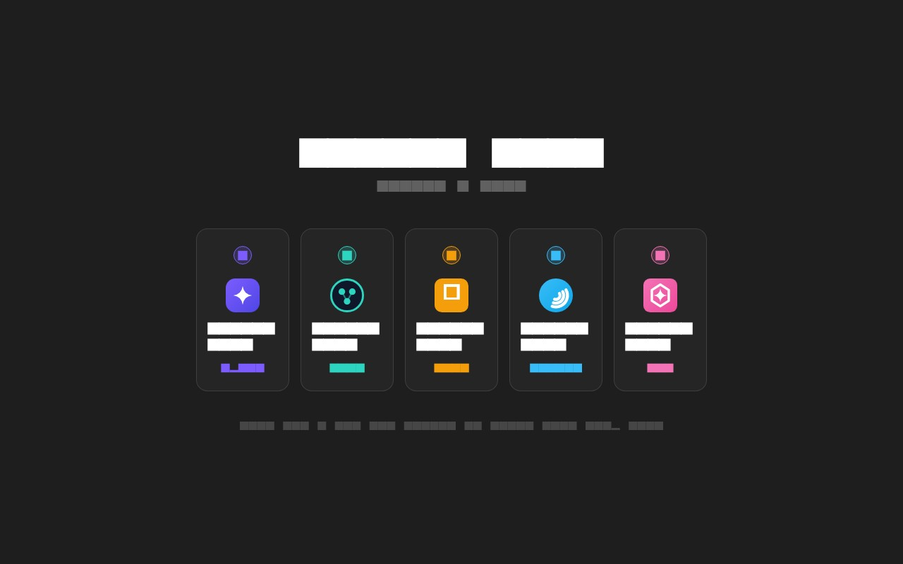
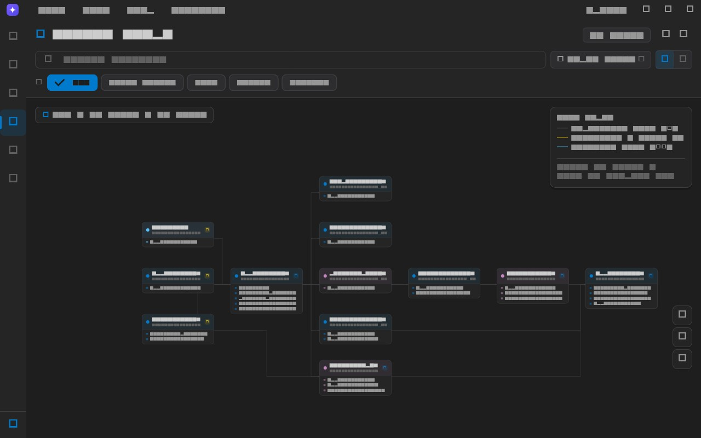
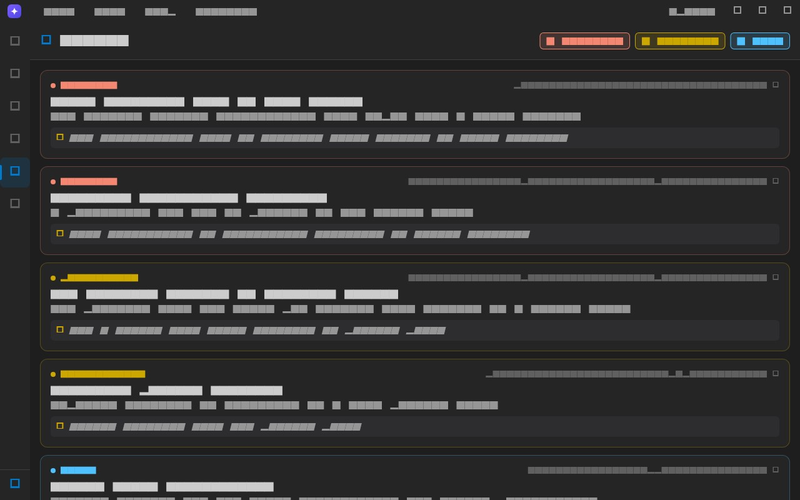
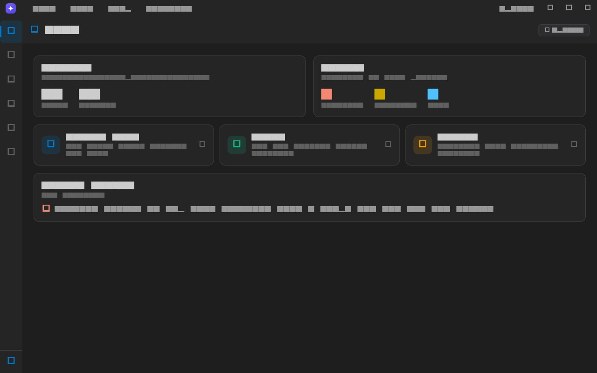

# Heides Lens


**The nervous system for your code, with eyes.**

Heides Lens is the visual companion to [HEIDES](https://github.com/AbduljabbarBXR/heides) — the deterministic code nervous system that maps every file, symbol, and call into a persistent graph, then guards every change against it. Lens is the UI: open a folder, see the mesh, query who-calls-what and review real findings.

It is not another coding assistant. It is the brain your codebase never had — visualized, queryable, and standing guard.

> All screenshots are rendered from the real app UI (same theme, fonts, layouts)
> via golden tests in `mobile/test/screenshots/`. Regenerate with
> `flutter test test/screenshots --update-goldens`.

## Documentation

- [User Guide](docs/user-guide.md) — visual walkthrough of every app section
- [HEIDES](https://github.com/AbduljabbarBXR/heides) — the engine: Spine graph, Harmony guards, Grounding plans
- [Architecture](ARCHITECTURE.md) — full design document
- [Release & Distribution](docs/RELEASE.md) — what's left: npm, MCP registry, Linux/Windows/macOS packaging

The app ships with an in-app documentation viewer: **Help → Documentation**.

## Table of Contents

- [Features](#features)
- [Documentation](#documentation)
- [Architecture](#architecture)
- [Installation](#installation)
- [Quick Start](#quick-start)
- [Configuration](#configuration)
- [Development](#development)
- [Contributing](#contributing)
- [Discussion](#discussion)
- [License](#license)

## Features

### First Launch



- Choose a logo for your Lens from five identity variants
- **HEIDES engine setup** — one click installs the engine locally (no account, no cloud)
- Interactive tour of the neural mesh, review, and guards

### Code Neural Mesh



- Layered dependency layout (Sugiyama-style) with aligned columns
- **Orthogonal edges** that route around cards — dependency flow, back-edges/cycles, and vertical links are color-coded
- Filter by node type, search, grid view toggle
- Navigation: drag to pan, double-click / wheel / pinch to zoom, minimap, fit-to-view

### Review (Findings)



- Real HEIDES `harmony` findings: security taint, edge cases, dependency risk
- Sorted blocker → critical → warning → info with file:line evidence
- Click a finding to preview the exact file and line

### Home (Dashboard)



- Interactive dashboard: project stats, health snapshot, and shortcuts
- Tappable cards navigate straight to the mesh and review
- Notification badges on the activity bar show unread counts per mode

### Indexing Engine
- SQLite-backed file scanner
- Symbol extraction (functions, classes)
- Import and call graph building
- Incremental indexing by file hash
- Findings storage per file

## Architecture

```
heides-lens/
├── mobile/                       # Heides Lens — Flutter desktop app
│   ├── lib/
│   │   ├── core/                 # App shell, providers, services
│   │   │   └── services/
│   │   │       ├── heides_service.dart     # MCP client (spawns `heides mcp`)
│   │   │       └── graph_analysis.dart     # Deterministic structural analysis
│   │   ├── features/             # Graph, Review, Docs
│   │   ├── shared/               # Themes, logos, widgets
│   │   └── data/                 # Indexing engine, SQLite
│   └── test/
├── docs/                         # User guide, release checklist
├── ARCHITECTURE.md               # Full design document
└── README.md                     # This file
```

### Data Flow

```
Open a folder
  → HEIDES spine.scan maps files, symbols, calls into .heides/index.db
  → Lens renders the neural mesh from the graph
  → spine.describe / spine.query answer every question (kilobytes, not megabytes)
  → harmony.check surfaces findings with file:line evidence
  → harmony.staged gates every proposed patch before it touches disk
```

## Installation

### HEIDES Engine (required)

The app installs HEIDES for you on first run. Manually:

```bash
npm install -g heides        # or: curl -fsSL .../install.sh | bash
```

### Desktop App

Requirements: Flutter 3.16+, Dart 3.2+

```bash
cd mobile
flutter pub get
flutter run
```

Desktop targets:
```bash
flutter run -d windows
flutter run -d macos
flutter run -d linux
```

Build:
```bash
flutter build windows
flutter build macos
flutter build linux
flutter build apk
flutter build ios
```

## Quick Start

### HEIDES CLI
```bash
# Map the codebase into the persistent spine graph
heides scan

# Who calls this symbol? Who imports it?
heides query callers send_order

# Guard the whole workspace
heides check

# Gate an agent's diff before it lands
heides staged patch.diff

# Validate a plan against the real graph
heides plan "refactor the checkout flow"
```

### App
1. Launch Heides Lens
2. First run: pick a logo → HEIDES engine installs itself (one click)
3. **Open a folder** — the neural mesh renders from the spine graph
4. Explore: hover the graph, review findings

## Configuration

### HEIDES
HEIDES needs no configuration — local by default, no account, no cloud.


## Development

### Prerequisites
- Node.js 18+
- Flutter 3.16+
- Dart 3.2+
- Git

### Setup
```bash
git clone https://github.com/AbduljabbarBXR/heides-lens.git
cd heides-lens

# Install CLI dependencies
npm install
npm run build

# Install Flutter dependencies
cd ../mobile
flutter pub get
```

### Testing
```bash
# CLI tests
npm test

# Flutter tests
cd mobile
flutter test

# Flutter analyze
flutter analyze
```

### Project Structure
```
mobile/
├── lib/
│   ├── core/              # App shell, providers, services
│   │   ├── providers/     # Riverpod state management
│   │   ├── services/      # HEIDES MCP client, indexing
│   │   └── app_shell.dart # Main shell with sidebar, menu bar
│   ├── features/          # Feature modules
│   │   ├── graph/         # Neural mesh visualization
│   │   ├── review/        # Findings panel
│   │   └── docs/          # In-app documentation
│   ├── shared/            # Themes, colors, widgets
│   └── data/              # Indexing engine, SQLite
└── test/                  # Widget and unit tests
```

## Contributing

Contributions are welcome. Please follow these guidelines:

1. Fork the repository
2. Create a feature branch: `git checkout -b feature/my-feature`
3. Commit your changes: `git commit -am 'Add my feature'`
4. Push to the branch: `git push origin feature/my-feature`
5. Submit a pull request

### Code Style
- Dart: follow Flutter style guide, run `flutter analyze`
- Commit messages: use conventional commits (feat, fix, docs, etc.)

### Reporting Issues
Please include:
- Heides Lens version
- Platform (OS, Flutter version, Node version)
- Steps to reproduce
- Expected vs actual behavior
- Screenshots or logs


## Discussion

Join the conversation:
- GitHub Issues: bug reports and feature requests
- GitHub Discussions: questions, ideas, show and tell

## License

MIT License. See LICENSE file for details.

---

Built with Flutter, Node.js, Tree-sitter, and SQLite.
