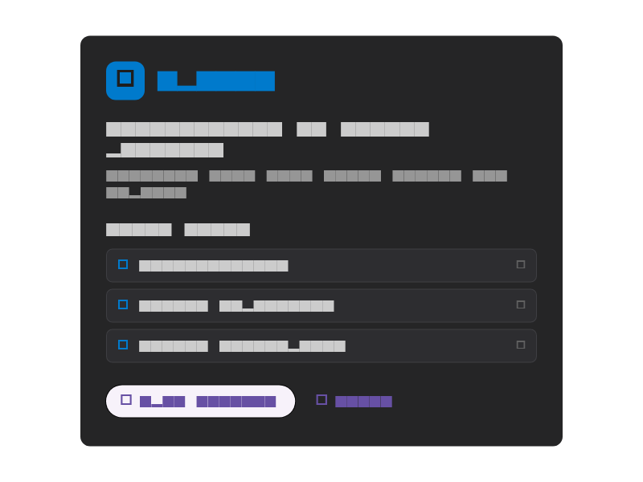
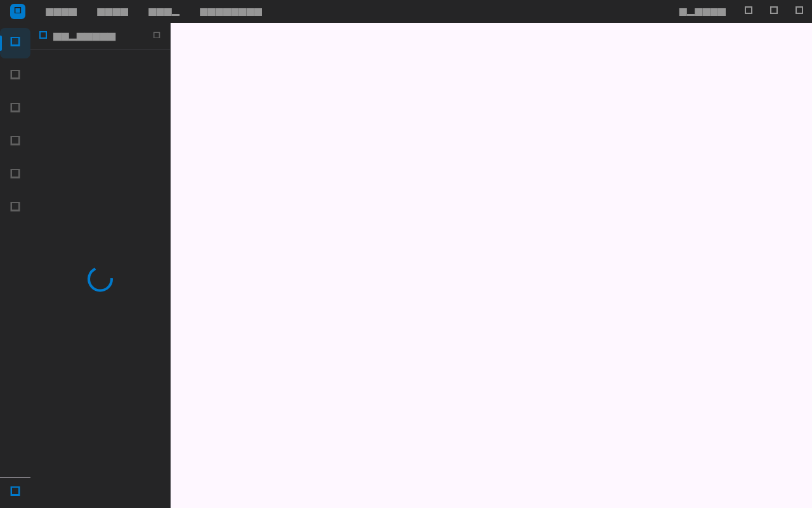
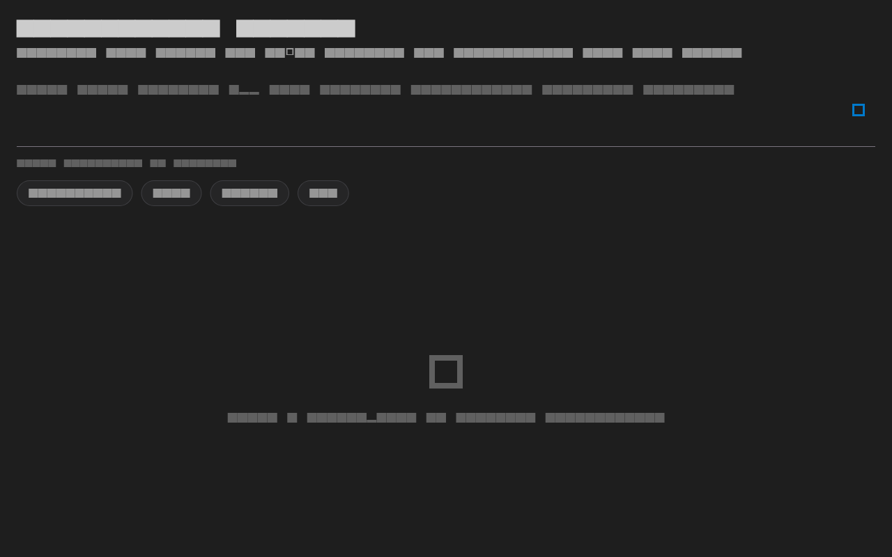
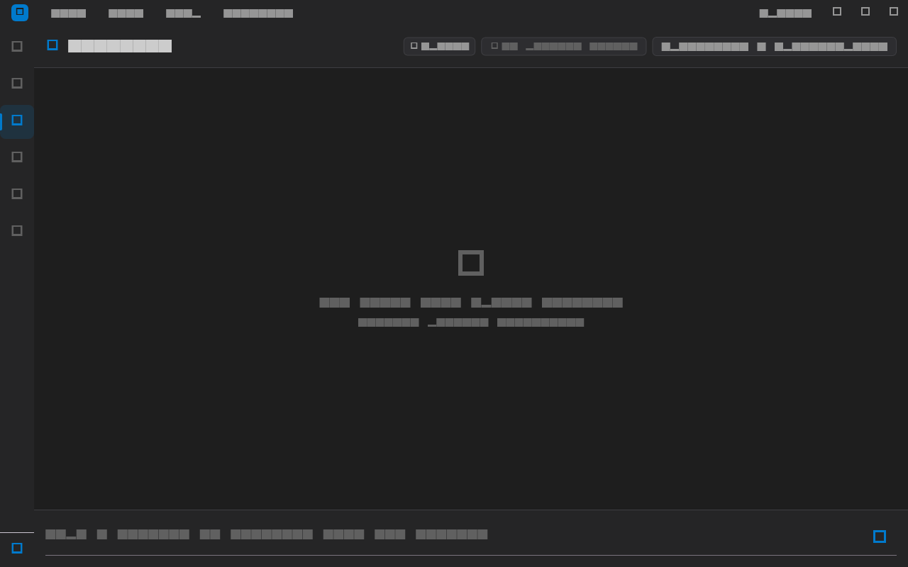
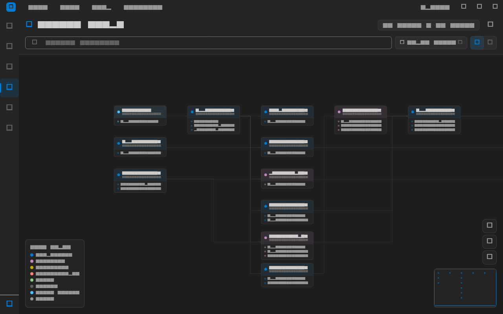
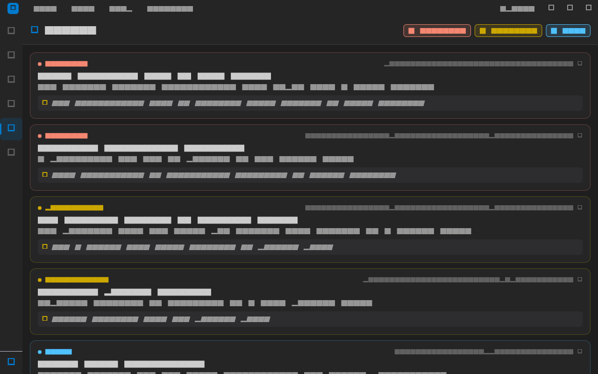
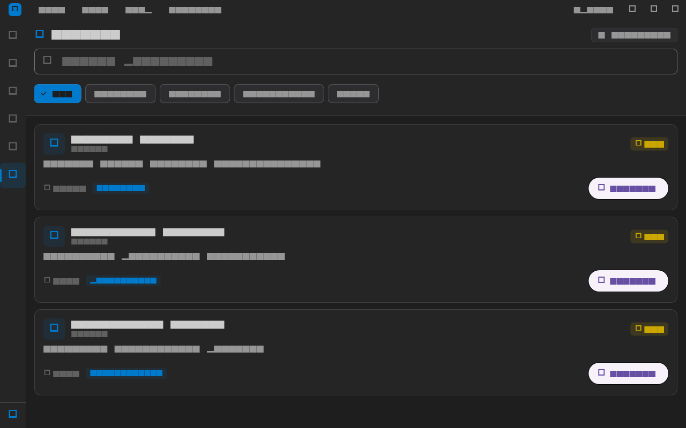
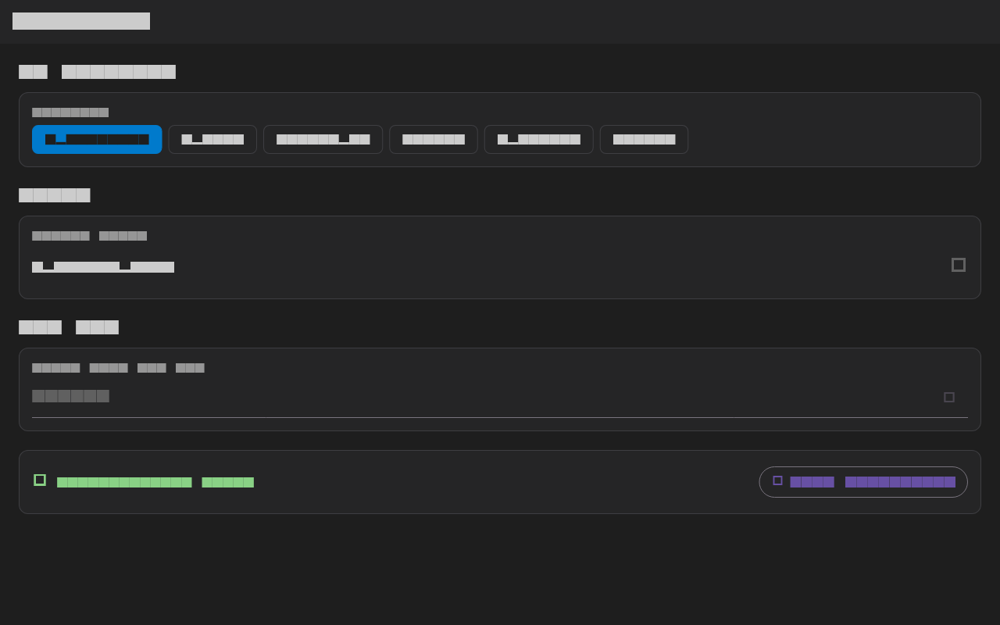

# Spikey User Guide

Plugin-first AI coding platform. Predicts what will break before you deploy.

This guide covers each section of the desktop app. All screenshots are rendered
from the real UI via golden tests — regenerate with
`flutter test test/screenshots --update-goldens`.

## 1. Welcome & Onboarding

- First launch shows an interactive tour of the four core capabilities:
  graph, chat, review, and plugins.
- The welcome dialog provides quick links to documentation, the repository,
  and the plugin marketplace.
- **Open Project** starts the project selector; selecting a folder kicks off
  indexing in the background.

## 2. Explorer (File Tree)

- Language-aware file tree with colored icons (Dart, TS/JS, Python, config, …).
- The sidebar is closed by default — open it with the Explorer icon in the
  activity bar or `Ctrl+1`.
- Click any file to open it in the viewer with breadcrumb navigation and
  line numbers. `Esc` returns to the previous view.

## 3. Plan Mode

- Describe a feature or architecture change and generate a scaffold with
  edge cases, error handling, and design patterns.
- Plan mode creates actual project files from the scaffold.

## 4. Workflow (Chat)

- Chat with an AI assistant that has full project context: file tree,
  dependencies, findings, and entry points are injected into the system
  prompt.
- The header badge shows when the AI can see the project.
- Responses render markdown with syntax-highlighted code blocks.
- Providers: OpenRouter, OpenAI, Anthropic, Gemini, Ollama.

## 5. Neural Graph

- Layered dependency layout (Sugiyama-style): entry points on the left,
  dependencies flowing right in aligned columns.
- Orthogonal edges route around cards with elbow joints — no lines crossing
  through nodes.
- **Filter** by node type via the dropdown (checkbox panel with All/None).
- **Search** filters files by name.
- **Navigation**: drag to pan, double-click to zoom at the cursor,
  mouse wheel / pinch to zoom, `+`/`−` buttons for stepped zoom,
  fit-to-view button, and a minimap with viewport indicator.
- Toggle to **Grid View** for a card-based overview sorted by type.

## 6. Review (Findings)

- Findings from static analysis, sorted critical → warning → info.
- Click a finding to preview the exact file with the target line highlighted.
- Inline suggestions for every finding.

## 7. Plugins (Marketplace)

- Browse the marketplace with live search and category filters.
- One-click install; installed plugins show state.
- Sandboxed execution model with manifest-driven permissions.

## 8. Settings

- Provider selection (OpenRouter, OpenAI, Anthropic, Gemini, Ollama).
- Model dropdown per provider.
- API keys stored in secure storage (or loaded from environment).
- **Test Connection** validates the key against the provider.