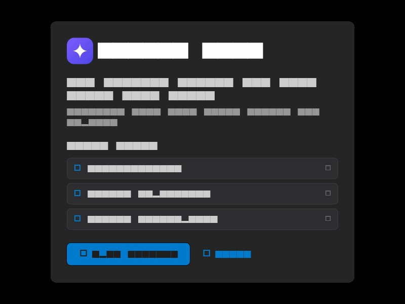

# Heides Lens User Guide

The nervous system for your code, with eyes.

This guide covers each section of the desktop app. All screenshots are rendered
from the real UI via golden tests — regenerate with
`flutter test test/screenshots --update-goldens`.

## 1. Home (Dashboard)

- Interactive dashboard that lands on launch: project stats, health snapshot,
  HEIDES engine status, and tappable cards that jump to the mesh and
  review.
- Notification badges on the activity bar show unread counts per mode.

## 2. Welcome & Onboarding

- First launch shows an interactive tour of the core capabilities:
  the mesh, review, and HEIDES engine.
- The welcome dialog provides quick links to documentation, the repository,
  and the HEIDES engine.
- **Open Folder** starts the project selector; selecting a folder kicks off
  indexing in the background.

## 3. Code Neural Mesh

- Layered dependency layout (Sugiyama-style): entry points on the left,
  dependencies flowing right in aligned columns.
- Orthogonal edges route around cards with elbow joints — no lines crossing
  through nodes.
- **Filter** by node type via the dropdown (checkbox panel with All/None).
- **Search** filters files by name.
- **Navigation**: drag to pan, double-click to zoom at the cursor,
  mouse wheel / pinch to zoom, `+`/`−` buttons for stepped zoom,
  fit-to-view button, and a minimap with viewport indicator.
- Toggle to **Grid View** for a card-based overview sorted by type.

## 5. Review (Findings)

- Findings from static analysis, sorted critical → warning → info.
- Click a finding to preview the exact file with the target line highlighted.
- Inline suggestions for every finding.